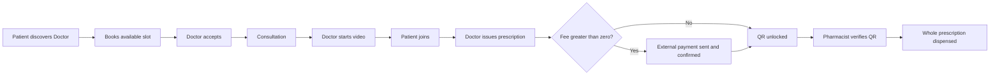
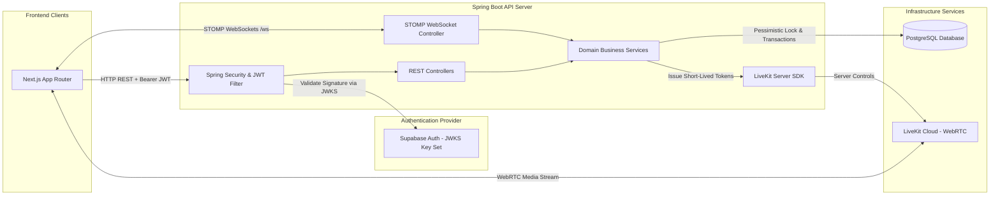
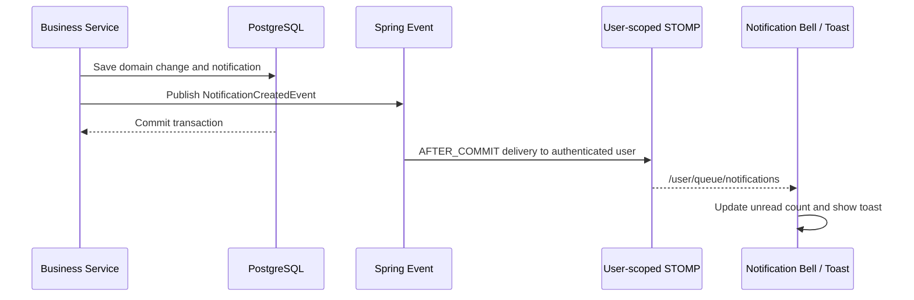
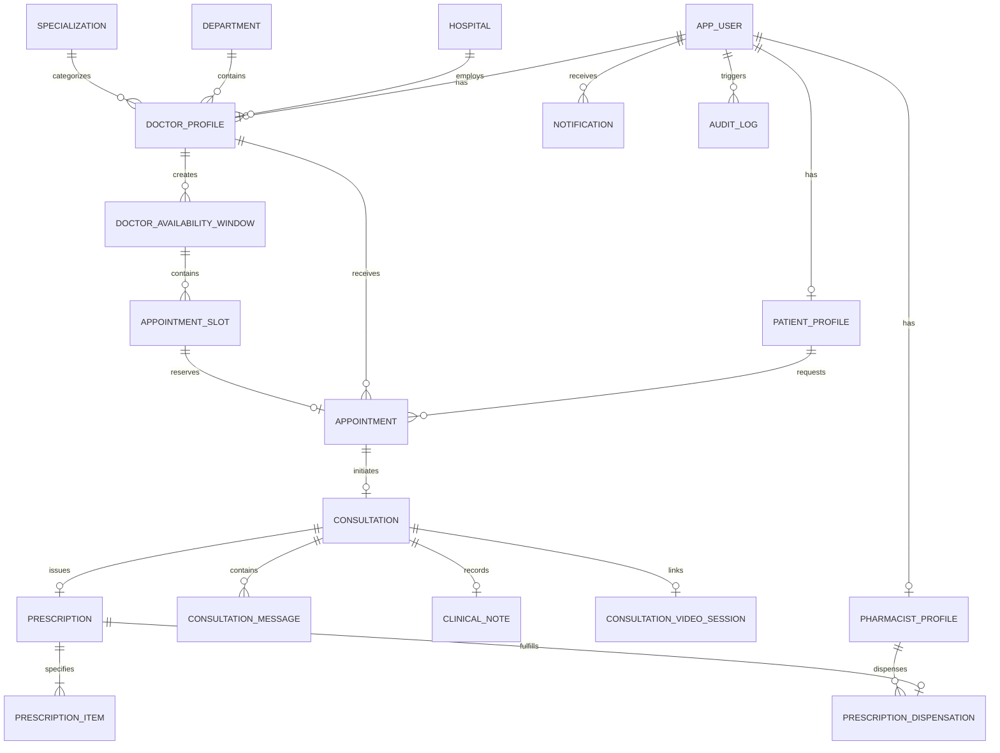

# MediSync Backend

MediSync is a full-stack healthcare workflow project for Patients, verified Doctors, verified Pharmacists, and Administrators. It brings discovery, scheduling, remote consultation, prescribing, external-payment confirmation, and pharmacy dispensing into one traceable workflow instead of spreading those steps across unrelated tools.

This repository is the authoritative Spring Boot API. Supabase Auth supplies user identity; the backend derives the current user from the validated JWT and enforces account status, role, professional verification, ownership, lifecycle, and concurrency rules. Its technically interesting parts include transactional slot locking, database-backed chat and notifications, post-commit user-scoped STOMP delivery, doctor-governed LiveKit access, hashed single-use QR tokens, and whole-prescription dispensing.

> MediSync is an engineering portfolio project, not a certified medical product or a claim of deployment in a hospital environment.

---

## Technology Stack

| Category | Technology / Library | Version | Purpose |
| :--- | :--- | :--- | :--- |
| **Language** | Java | `17` | Standard LTS Java development environment |
| **Framework** | Spring Boot | `3.5.7` | Framework for web services, security, REST APIs, and data access |
| **Security** | Spring Security & OAuth2 Resource Server | `6.x` | Role-based authorization, request filtering, and Supabase JWKS JWT validation |
| **Database** | PostgreSQL | Managed driver | Relational storage for users, appointments, consultations, prescriptions, notifications, and audits |
| **ORM / Data Access** | Spring Data JPA / Hibernate | Spring Boot managed | Entity mappings, repositories, pessimistic locking, and transactional queries |
| **Schema Migration** | Flyway | Spring Boot managed | Versioned schema migrations (`V1` through `V16`) and startup validation |
| **Realtime WebSockets** | Spring WebSocket & STOMP Broker | `3.5.7` | Authenticated STOMP messaging over WebSockets for live chat and notifications |
| **Video Infrastructure** | LiveKit Java Server SDK (`io.livekit:livekit-server`) | `0.15.0` | Server-side JWT token generation and WebRTC video room governance |
| **Build & Test** | Maven, JUnit 5, Mockito, Spring Security Test | Spring Boot managed | Build automation, unit tests, security tests, and integration tests |

---

## Core Responsibilities

- **Identity & Role Enforcement**: Maps Supabase JWT subjects to database users and verifies permissions for `PATIENT`, `DOCTOR`, `PHARMACIST`, and `ADMIN` roles.
- **Professional Licensing & Verification**: Processes registration profiles and license submissions for Doctors and Pharmacists, requiring explicit Administrator review before activation.
- **Scheduling & Concurrency Locking**: Manages Doctor availability windows and slot reservations, enforcing pessimistic locking (`PESSIMISTIC_WRITE`) and database partial unique constraints to prevent double-booking.
- **Consultation Session Governance**: Manages appointment state transitions (`REQUESTED` → `CONFIRMED` → `IN_PROGRESS` → `COMPLETED` / `CANCELLED`), securing consultation chat and Doctor private clinical notes.
- **LiveKit Video Authorization**: Issues short-lived, role-aware LiveKit tokens strictly after scheduled start times, reserving call initiation to assigned Doctors.
- **Prescription Lifecycle & Hashed QR**: Stores structured medication items and issues single-use prescription QR tokens. Tokens are stored exclusively as SHA-256 hashes.
- **Payment Workflow Enforcement**: Tracks positive-fee prescription payments, supports receipt upload verification, and requires explicit Doctor payment confirmation before QR generation.
- **Pharmacist Dispensing & Revocation**: Validates presented QR token hashes, displays safe medication details to verified Pharmacists, and executes single-use transactional dispensing.
- **Transactional STOMP Notifications**: Publishes user-scoped notification events (`AFTER_COMMIT`) to ensure realtime alerts are dispatched only when database transactions succeed.
- **Audit Logging & Governance**: Maintains append-only audit records for critical clinical and administrative events.

---

## Roles and Capabilities

| Capability | Patient | Doctor | Pharmacist | Admin |
| :--- | :---: | :---: | :---: | :---: |
| Discover verified Doctors and view slots | Yes | — | — | — |
| Book, view, or cancel an appointment | Yes | — | — | — |
| Accept, reject, or cancel a request | — | Yes | — | — |
| Start a consultation and LiveKit session | — | Yes | — | — |
| Join an active LiveKit session | Yes | Yes | — | — |
| Use persistent consultation chat | Yes | Yes | — | — |
| Maintain private clinical notes | — | Yes | — | — |
| Draft, issue, or cancel a prescription | — | Yes | — | — |
| Mark external payment sent / confirm receipt | Yes | Yes | — | — |
| Generate a prescription QR | Yes | — | — | — |
| Verify and dispense a whole prescription | — | — | Yes | — |
| Verify professionals and govern accounts | — | — | — | Yes |
| View operational analytics and audit events | — | — | — | Yes |

---

## End-to-End Workflow



---

## System Architecture



---

## Notification Delivery Sequence



Notifications are persisted before delivery, can be read after reconnecting, and use a unique deduplication key where a business event must not create duplicate rows. Clients may subscribe only to the two allow-listed private user destinations; STOMP `SEND` is rejected because consultation writes go through secured REST services.

---

## Sequence Diagram

```mermaid
sequenceDiagram
    actor Patient
    participant API as Spring Boot API
    participant DB as PostgreSQL
    actor Doctor
    participant LK as LiveKit Cloud
    actor Pharmacist

    Patient->>API: POST /api/patient/appointments
    API->>DB: Lock Patient and slot; create REQUESTED booking
    Doctor->>API: POST /api/doctor/appointments/{id}/accept
    API->>DB: Confirm booking and create scheduled consultation
    API-->>Patient: User-scoped appointment notification

    Doctor->>API: POST /api/doctor/consultations/{id}/start
    API->>DB: Consultation becomes IN_PROGRESS
    Doctor->>API: POST /api/doctor/consultations/{id}/video/start
    API->>DB: Create one ACTIVE video session
    API-->>Doctor: Short-lived LiveKit token and server URL
    Doctor->>LK: Join opaque room
    API-->>Patient: VIDEO_CALL_STARTED notification
    Patient->>API: POST /api/patient/consultations/{id}/video/join
    API-->>Patient: Short-lived LiveKit token and server URL
    Patient->>LK: Join same opaque room

    Doctor->>API: POST /api/doctor/prescriptions/{id}/issue
    API->>DB: Persist ISSUED prescription and items
    alt Positive fee
        Patient->>API: POST /api/patient/consultations/{id}/payment-sent
        API-->>Doctor: PAYMENT_SENT notification
        Doctor->>API: POST /api/doctor/prescriptions/{id}/confirm-payment
        API->>DB: Mark payment CONFIRMED
    else Zero fee
        API->>DB: Payment NOT_REQUIRED
    end
    Patient->>API: POST /api/patient/prescriptions/{id}/qr
    API->>DB: Store SHA-256 token hash
    API-->>Patient: Return raw token once for QR rendering

    Pharmacist->>API: POST /api/pharmacist/prescriptions/verify
    API->>DB: Hash payload and find usable token
    API-->>Pharmacist: Safe prescription view
    Pharmacist->>API: POST /api/pharmacist/prescriptions/dispense
    API->>DB: Lock, insert one dispensation, revoke token
    API-->>Patient: DISPENSED notification
```

---

## Domain Model & Entity Definitions

| Entity | Package | Description | Key Relationships |
| :--- | :--- | :--- | :--- |
| `AppUser` | `com.medisync.user` | Core user identity, role (`PATIENT`, `DOCTOR`, `PHARMACIST`, `ADMIN`), and status | 1:1 with Role Profiles, 1:N with Notifications |
| `PatientProfile` | `com.medisync.user` | Personal details, phone number, and emergency contact for patients | 1:1 with `AppUser`, 1:N with `Appointment` |
| `DoctorProfile` | `com.medisync.doctor` | Professional licensing, bio, verification status, hospital, department, and specialty | 1:1 with `AppUser`, 1:N with `AppointmentSlot` |
| `PharmacistProfile` | `com.medisync.pharmacy` | Pharmacy registration, license number, pharmacy name, and verification status | 1:1 with `AppUser`, 1:N with `PrescriptionDispensation` |
| `Hospital` | `com.medisync.hospital` | Affiliated hospital or clinical institution | 1:N with `DoctorProfile` |
| `Department` | `com.medisync.department` | Hospital medical department | 1:N with `DoctorProfile` |
| `Specialization` | `com.medisync.specialization` | Doctor medical specialization | 1:N with `DoctorProfile` |
| `DoctorAvailabilityWindow`| `com.medisync.availability` | Date-based availability schedule created by a doctor | 1:N with `AppointmentSlot` |
| `AppointmentSlot` | `com.medisync.availability` | Individual 30-minute consultation time slot (`AVAILABLE`, `RESERVED`, `BOOKED`, `BLOCKED`) | N:1 with `DoctorAvailabilityWindow` |
| `Appointment` | `com.medisync.appointment` | Consultation booking record (`REQUESTED`, `CONFIRMED`, `REJECTED`, `CANCELLED_*`) | 1:1 with `AppointmentSlot`, 1:1 with `Consultation` |
| `Consultation` | `com.medisync.consultation` | Active online consultation session (`SCHEDULED`, `IN_PROGRESS`, `COMPLETED`, `CANCELLED`) | 1:1 with `Appointment`, 1:N with `ConsultationMessage` |
| `ConsultationMessage` | `com.medisync.consultation` | Persistent chat message supporting text and private media attachments | N:1 with `Consultation`, N:1 with `AppUser` (Sender) |
| `ClinicalNote` | `com.medisync.consultation` | Doctor-private clinical observations and notes | 1:1 with `Consultation` |
| `ConsultationVideoSession` | `com.medisync.consultation` | Active WebRTC video call metadata and session status | 1:1 with `Consultation` |
| `Prescription` | `com.medisync.prescription` | Structured digital prescription (`DRAFT`, `ISSUED`, `CANCELLED`) | 1:1 with `Consultation`, 1:N with `PrescriptionItem` |
| `PrescriptionItem` | `com.medisync.prescription` | Individual medication line item (name, dosage, frequency, duration, instructions) | N:1 with `Prescription` |
| `PrescriptionDispensation` | `com.medisync.pharmacy` | Immutable record of prescription fulfillment at a pharmacy | 1:1 with `Prescription`, N:1 with `PharmacistProfile` |
| `Notification` | `com.medisync.notification` | Persistent, user-scoped realtime notification alert | N:1 with `AppUser` |
| `AuditLog` | `com.medisync.audit` | Append-only operational audit entry for governance review | N:1 with `AppUser` (Actor) |

---

## Database Relationship Diagram



---

## Authentication & Authorization

MediSync uses a stateless JWT authentication strategy integrated with Supabase Auth:

1. **JWKS Token Validation**: Spring Security's OAuth2 Resource Server validates incoming Bearer JWT tokens against Supabase's JSON Web Key Set (JWKS) URL (`/auth/v1/.well-known/jwks.json`).
2. **User Synchronization**: Upon receiving a valid JWT, `UserController.getMe()` inspects the subject claim (`sub`). If no database user exists, an onboarding flag is returned. Onboarding transactionally initializes the `AppUser` and role profile.
3. **Role Enforcement**: API routes and method security annotations (`@PreAuthorize`) enforce strict role permissions (`ROLE_PATIENT`, `ROLE_DOCTOR`, `ROLE_PHARMACIST`, `ROLE_ADMIN`).
4. **Professional Verification Gate**: Doctors and Pharmacists remain in `PENDING_VERIFICATION` status until approved by an Administrator. Pending professionals are restricted from clinical features until activated.

---

## Doctor Availability & Appointment Booking Engine

- **Availability Windows**: Doctors specify date-based availability windows. The API automatically generates 30-minute `AppointmentSlot` entities.
- **Pessimistic Concurrency Locking**: When a patient books an appointment (`POST /api/patient/appointments`), the backend acquires `PESSIMISTIC_WRITE` locks on both the `PatientProfile` and the target `AppointmentSlot`.
- **Double-Booking Protection**: In addition to pessimistic locking, a PostgreSQL partial unique index (`uk_appointments_active_slot`) prevents multiple active appointments (`REQUESTED` or `CONFIRMED`) on the same slot.
- **Lead-Time Rules**: Slots must satisfy a configurable minimum lead time (`APPOINTMENT_MIN_LEAD_MINUTES`) relative to the server clock.

---

## Consultation Lifecycle & Persistent Chat

1. **State Machine**:
   - `SCHEDULED`: Created automatically upon Doctor accepting an appointment request.
   - `IN_PROGRESS`: Triggered when the Doctor starts the video consultation.
   - `COMPLETED`: Set when the Doctor completes the consultation.
   - `CANCELLED`: Updated if an appointment is cancelled prior to starting.
2. **Persistent Chat**:
   - Patient and Doctor exchange messages via `GET/POST /api/{role}/consultations/{id}/messages`.
   - Message payloads support up to 4,000 characters and up to 4 private image/receipt attachments.
   - Attachments undergo content-type validation and magic-byte inspection. Private media files are served via short-lived pre-signed URLs.
3. **Doctor Private Clinical Notes**:
   - Doctors maintain private clinical notes via `GET/PUT /api/doctor/consultations/{id}/clinical-note`.
   - Clinical notes are strictly isolated and never returned in Patient, Pharmacist, or STOMP payloads.

---

## LiveKit Video Consultation Backend

- **Doctor-governed start**: Only the assigned Doctor can create the session, only after the booked start time and after the consultation has entered `IN_PROGRESS`.
- **Patient join gate**: The assigned Patient can obtain a join token only after an active Doctor-started session exists.
- **Short-lived credentials**: `LiveKitTokenService` mints role-aware room tokens on the backend. The API key and secret belong only in backend environment configuration and are never client settings.
- **Opaque media identity**: Room names and participant identities are random/opaque identifiers. Clinical details are not placed in LiveKit metadata.
- **Separated responsibilities**: LiveKit carries live audio/video. MediSync chat remains a separate, persistent PostgreSQL/STOMP workflow.
- **Lifecycle shutdown**: Consultation cancellation or completion marks the video session ended and schedules LiveKit room deletion after the surrounding transaction commits.
- **No recording**: This project does not implement call recording or media storage.

---

## Digital Prescription & QR Workflow

1. **Drafting & Issuance**: Assigned Doctors draft prescriptions during active consultations. Issuance transitions the draft into an immutable `ISSUED` state.
2. **Cryptographic Token Generation**: When a Patient requests a QR code (`POST /api/patient/prescriptions/{id}/qr`), the server generates a 256-bit `SecureRandom` token (`MEDISYNC:RX:<token>`).
3. **SHA-256 Hash Storage**: The raw token is returned once to the Patient for rendering. PostgreSQL stores only the lowercase SHA-256 hash.
4. **Token Invalidation**: Re-generating a QR code replaces the token hash, instantly invalidating previous QR codes.

---

## Payment Workflow Engine

MediSync does not collect card details or settle money. For a positive fee, the prescription carries the Doctor's external payment instructions; the Patient pays outside MediSync, may attach a receipt in private consultation chat, and explicitly marks payment sent. The Doctor receives a realtime update and confirms receipt through `POST /api/doctor/prescriptions/{id}/confirm-payment`. Confirmation notifies the Patient and unlocks QR generation. A zero fee uses `NOT_REQUIRED` and needs no manual confirmation.

---

## Pharmacist QR Verification & Dispensing

1. **Verification**: Pharmacists present the raw scanned QR payload to `POST /api/pharmacist/prescriptions/verify`. The API hashes the payload, queries the matching `token_hash`, and returns safe medication items without mutating state.
2. **Transactional Dispensing**: Calling `POST /api/pharmacist/prescriptions/dispense` acquires a pessimistic write lock on the prescription:
   - Validates that the prescription is not expired, cancelled, or already dispensed.
   - Inserts an immutable `PrescriptionDispensation` record.
   - Revokes the QR token hash permanently.
   - Dispatches a `DISPENSED` notification event to the Patient.
3. **Single-Use Constraint**: A database unique constraint on `prescription_id` in `prescription_dispensations` guarantees that no prescription can be dispensed more than once.

---

## Database Schema & Flyway Migrations

Migrations execute automatically on application startup. Hibernate uses `ddl-auto=validate`.

| Migration Script | Description |
| :--- | :--- |
| `V1__create_app_users.sql` | Base `app_users` table with email, identity subject, and account status |
| `V2__create_role_profiles.sql` | `patient_profiles`, `doctor_profiles`, and `pharmacist_profiles` tables |
| `V3__phase_2a_doctor_verification_foundation.sql` | `hospitals`, `departments`, `specializations`, and professional verification fields |
| `V4__phase_2b_availability_and_appointments.sql` | `doctor_availability_windows`, `appointment_slots`, and `appointments` |
| `V5__phase_3_online_consultations_and_chat.sql` | `consultations`, `consultation_messages`, and `clinical_notes` |
| `V6__phase_4_digital_prescriptions_and_qr.sql` | `prescriptions`, `prescription_items`, and QR token metadata |
| `V7__phase_4_security_and_availability_hardening.sql` | SHA-256 token hash migration and security indexes |
| `V8__phase_5_pharmacist_verification_and_dispensing.sql` | `prescription_dispensations` table with unique constraints |
| `V9__final_admin_media_payment_expansion.sql` | Admin user management, audit logs, media metadata, and manual payment fields |
| `V10__account_deletion_and_anonymization.sql` | Support for account deletion and data anonymization |
| `V11__add_deleted_status_to_constraint.sql` | Updates user status constraints to include `DELETED` |
| `V12__doctor_payment_information.sql` | Doctor payment/banking information schema |
| `V13__add_message_soft_delete.sql` | Soft-delete columns for consultation chat messages |
| `V14__realtime_notifications.sql` | `notifications` schema with unread tracking |
| `V15__video_consultations.sql` | `consultation_video_sessions` table for LiveKit WebRTC state |
| `V16__fix_video_sessions.sql` | Refinement of video session constraints and indexes |

---

## Security & Privacy Safeguards

- **JWT verification**: Access tokens are validated against the configured Supabase issuer/JWKS, ES256 signature algorithm, and audience.
- **Backend-derived authorization**: Services resolve the database user from the JWT subject rather than trusting client-supplied user or role identifiers.
- **Role, status, verification, and ownership checks**: Spring Security route rules are reinforced by service-level access checks for the assigned Patient/Doctor and verified professional profiles.
- **Private realtime destinations**: Authenticated STOMP clients may subscribe only to `/user/queue/consultation-events` and `/user/queue/notifications`; client `SEND` frames are rejected.
- **Backend-only LiveKit authority**: The backend mints short-lived tokens for opaque rooms and identities. LiveKit secrets must remain server-side, and no clinical metadata is sent to the provider.
- **Hashed QR Secrets**: Raw QR tokens are never persisted in the database; only SHA-256 hashes are stored.
- **Clinical and admin boundaries**: Pharmacists cannot read chat or notes; Patients cannot read Doctor notes; Admin APIs expose governance/operational data rather than clinical content, payment account fields, or QR secrets.
- **Private media**: Uploads are size/type/magic-byte checked, stored in a private Supabase bucket, and returned through short-lived signed URLs.
- **Account enforcement**: Banned, pending, rejected, and deleted states are checked by the backend and WebSocket authentication layer.
- **Secret handling requirement**: Database, Supabase service-role, and LiveKit credentials must be injected through the deployment environment and never exposed to the browser or committed to source control.

---

## Concurrency and Integrity

- Booking locks the Patient and target slot with `PESSIMISTIC_WRITE`; a partial unique index also prevents two active appointments from owning one slot.
- Availability and professional-profile update paths use pessimistic repository locks where concurrent state changes matter.
- One active prescription draft per consultation is protected by a database index, while medicine positions are unique within a prescription.
- QR generation replaces the prior token hash; verification hashes the submitted payload, and dispensing locks the prescription/token before inserting a unique dispensation and revoking the token.
- The video table permits one session per consultation and one provider room name; creation handles a competing insert as a conflict rather than creating two rooms.
- Notification deduplication uses a unique `dedupe_key`, and realtime publication occurs after the database transaction commits.

---

## API Overview & Key Endpoints

### Public & Health
- `GET /api/health` — API health status check

### Authentication & Users (`/api/users`)
- `GET /api/users/me` — Retrieve authenticated user profile
- `POST /api/users/onboarding` — Complete role onboarding (`PATIENT`, `DOCTOR`, `PHARMACIST`)

### Doctor Availability & Appointments (`/api/doctor`)
- `GET/POST /api/doctor/availability` — Manage availability windows and slots
- `GET /api/doctor/appointments` — List received appointment requests
- `POST /api/doctor/appointments/{id}/accept` — Accept appointment request
- `POST /api/doctor/appointments/{id}/reject` — Reject appointment request

### Patient Discovery & Booking (`/api/patient`)
- `GET /api/patient/doctors` — Search active verified doctors
- `GET /api/patient/doctors/{id}/slots` — View available doctor slots
- `POST /api/patient/appointments` — Atomically reserve slot and submit symptoms

### Consultations & Chat (`/api/patient` & `/api/doctor`)
- `GET /api/{role}/consultations/{id}` — Retrieve consultation session
- `GET/POST /api/{role}/consultations/{id}/messages` — Read or post chat messages
- `POST /api/doctor/consultations/{id}/start` — Move the consultation to `IN_PROGRESS`
- `POST /api/doctor/consultations/{id}/video/start` — Create/reuse the active room and issue the Doctor token
- `POST /api/patient/consultations/{id}/video/join` — Issue the Patient token after the Doctor starts video
- `POST /api/patient/consultations/{id}/payment-sent` — Notify the Doctor of an external payment
- `POST /api/doctor/consultations/{id}/complete` — Complete consultation
- `GET/PUT /api/doctor/consultations/{id}/clinical-note` — Manage doctor private note

### Prescriptions & QR (`/api/doctor` & `/api/patient`)
- `POST /api/doctor/prescriptions/{id}/issue` — Issue digital prescription
- `POST /api/doctor/prescriptions/{id}/confirm-payment` — Confirm patient payment receipt
- `POST /api/patient/prescriptions/{id}/qr` — Generate single-use QR token

### Pharmacist Verification & Dispensing (`/api/pharmacist`)
- `POST /api/pharmacist/prescriptions/verify` — Verify scanned QR token hash
- `POST /api/pharmacist/prescriptions/dispense` — Execute single-use dispensing transaction
- `GET /api/pharmacist/dispensations` — View dispensing audit history

### Admin Governance (`/api/admin`)
- `GET /api/admin/users` — Paginated user directory with Ban/Unban capabilities
- `GET/POST /api/admin/doctors/**` — Review Doctor verification applications
- `GET/POST /api/admin/pharmacists/**` — Review Pharmacist verification applications
- `GET /api/admin/analytics/summary` — Aggregate platform metrics
- `GET /api/admin/audit-logs` — Filterable system audit logs

### Notifications (`/api/notifications`)
- `GET /api/notifications` — Paginated authenticated-user notification history
- `GET /api/notifications/unread-count` — Unread badge count
- `PATCH /api/notifications/{id}/read` / `POST /api/notifications/read-all` — Read-state updates

---

## Project Structure

```text
d:/MediSync/backend/
├── src/
│   ├── main/
│   │   ├── java/com/medisync/
│   │   │   ├── admin/          # Admin governance & user management controllers
│   │   │   ├── appointment/    # Booking management, status transitions, and locking
│   │   │   ├── audit/          # Append-only system audit logging service
│   │   │   ├── availability/   # Doctor availability windows and slot generation
│   │   │   ├── common/         # Base entities, DTOs, and global constants
│   │   │   ├── config/         # Security, WebSocket STOMP, and CORS configurations
│   │   │   ├── consultation/   # Consultation sessions, chat, clinical notes, and video
│   │   │   ├── department/     # Department reference data management
│   │   │   ├── doctor/         # Doctor profiles and licensing services
│   │   │   ├── exception/      # Global exception handling and error DTOs
│   │   │   ├── hospital/       # Hospital reference data management
│   │   │   ├── media/          # Private media upload, magic-byte check, & signed URLs
│   │   │   ├── notification/   # STOMP notification event publisher and repository
│   │   │   ├── pharmacy/       # Pharmacist profiles, QR verification, & dispensing
│   │   │   ├── prescription/   # Digital prescription drafting, issuing, and QR hashing
│   │   │   ├── security/       # Supabase JWT authentication filter and security context
│   │   │   ├── specialization/ # Specialization reference data management
│   │   │   └── user/           # User identity, profile controllers, and onboarding
│   │   └── resources/
│   │       ├── application.yml        # Spring Boot configuration and environment bindings
│   │       └── db/migration/   # Flyway incremental database migration scripts
│   └── test/                   # Unit and integration tests (JUnit 5 & Mockito)
├── pom.xml                     # Maven build specification and dependencies
└── README.md                   # Backend documentation master file
```

---

## Environment Variables

The current configuration reads the following environment variable names. Keep their values in a local untracked environment or deployment secret store.

```env
DB_HOST=
DB_NAME=
DB_USERNAME=
DB_PASSWORD=
SUPABASE_URL=
SUPABASE_JWKS_URL=
SUPABASE_JWT_AUDIENCE=
SUPABASE_SERVICE_ROLE_KEY=
SUPABASE_STORAGE_BUCKET=
FRONTEND_URL=
APPOINTMENT_MIN_LEAD_MINUTES=
MEDIA_SIGNED_URL_SECONDS=
MEDIA_MAX_IMAGE_BYTES=
DOCTOR_FEE_CURRENCY=
LIVEKIT_URL=
LIVEKIT_API_KEY=
LIVEKIT_API_SECRET=
```

`server.port` currently defaults to `8080`. The JDBC URL currently uses the configured host, database name, and a fixed pooler port; `DB_PORT` appears in `.env.example` but is not consumed by `application.yml`.

---

## Installation & Running Locally

### Prerequisites
- Java 17
- Maven
- A PostgreSQL database reachable by the configured JDBC settings
- Supabase project values for Auth/JWKS and private media
- LiveKit project values for video consultations

### 1. Build Project
```powershell
cd MediSync-backend
mvn clean compile
```

### 2. Run Application
```powershell
mvn spring-boot:run
```
The API server listens on `http://localhost:8080` with the checked-in configuration.

### 3. Verify Health
```powershell
curl http://localhost:8080/api/health
```
Expected output: `{"status":"UP"}`

---

## Testing

```powershell
# Run unit and security tests
mvn test

# Run full package verification
mvn package
```

---

## Known Limitations

- Video is live-only: there is no recording, transcription, or stored media archive.
- Payments occur externally; MediSync does not include an internal card gateway, refunds, or settlement processing.
- Dispensing is whole-prescription and single-use; partial fills are not implemented.
- Insurance, laboratory, and external electronic-health-record integrations are outside the current scope.
- Supabase is required for authentication/private media and LiveKit Cloud is required for video.
- The root-level analytics integration/debug tests require a configured external database and are not isolated unit tests.
- The project has not been presented as formally certified for regulatory or clinical production use.

## Future Improvements

- Move external analytics checks into an explicit integration-test profile with disposable test data.
- Add containerized local infrastructure and CI workflows for repeatable full-stack verification.
- Add observability for REST, STOMP, Flyway, and LiveKit room lifecycle failures.
- Expand accessibility and end-to-end browser coverage across all role workflows.

## Companion Frontend Repository

[MediSync Frontend](https://github.com/dulanprabashwara/Medisync-frontend) contains the Next.js App Router interface, STOMP client, LiveKit room UI, QR rendering/scanning, and role portals.

---

## Project Context

MediSync is a serious full-stack engineering and portfolio project demonstrating a connected healthcare workflow, relational modeling, authorization boundaries, realtime delivery, third-party media integration, and concurrency-aware service design. It is not represented as a real hospital deployment, regulatory certification, or substitute for clinical governance.
