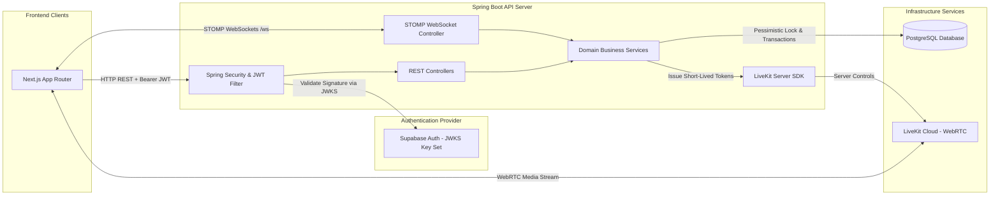
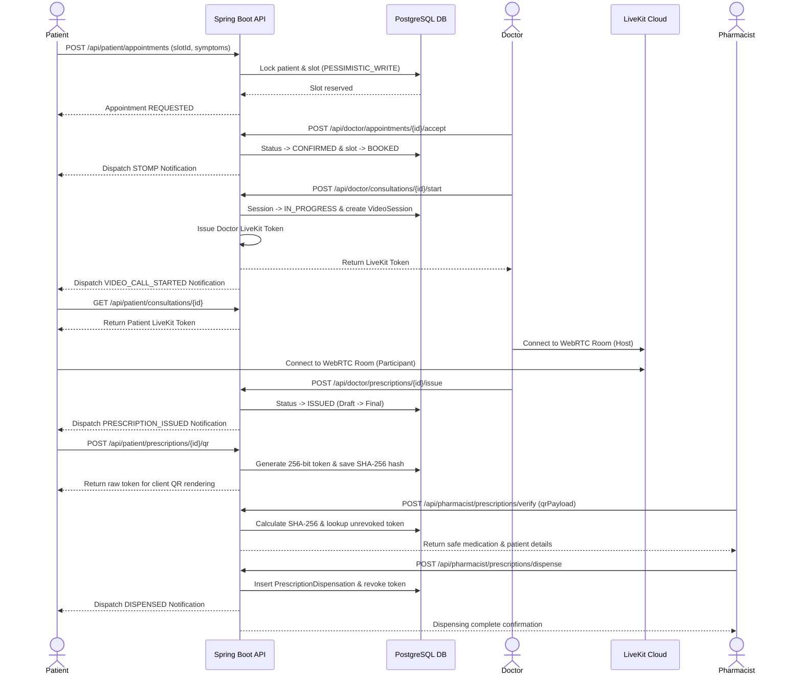
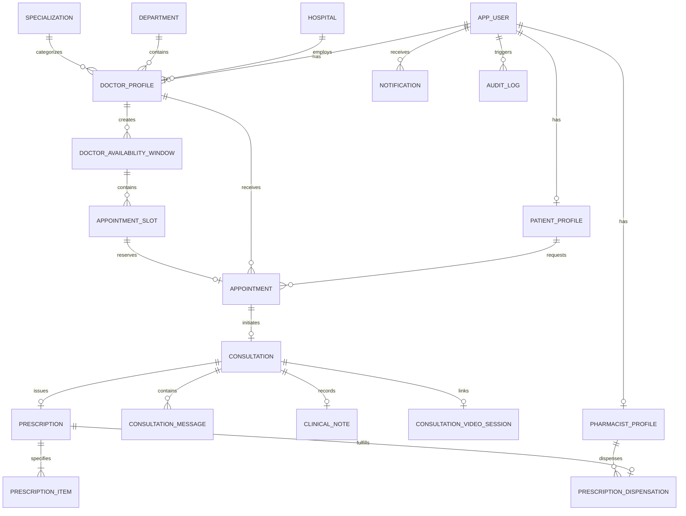

# MediSync API

MediSync API is a Spring Boot 3.5 application providing backend REST endpoints, STOMP WebSockets, authentication integration, data persistence, and security controls for the MediSync digital healthcare platform.

The API acts as the authoritative backend service for patient discovery, doctor availability scheduling, appointment slot locking, consultation lifecycle management, persistent chat messaging, doctor-controlled LiveKit video token issuance, digital prescription hashing, manual payment confirmation, and single-use QR pharmacy dispensing. Authenticated identity and credentials are managed via Supabase Auth, while Spring Boot enforces role authorization, business rules, transactional concurrency, and relational persistence in PostgreSQL.

---

## Technology Stack

| Category | Technology / Library | Version | Purpose |
| :--- | :--- | :--- | :--- |
| **Language** | Java | `17` | Standard LTS Java development environment |
| **Framework** | Spring Boot | `3.5.7` | Framework for web services, security, REST APIs, and data access |
| **Security** | Spring Security & OAuth2 Resource Server | `6.x` | Role-based authorization, request filtering, and Supabase JWKS JWT validation |
| **Database** | PostgreSQL | `15+` | Relational storage for users, appointments, consultations, prescriptions, and audits |
| **ORM / Data Access** | Spring Data JPA (Hibernate) | `3.x` | Entity mappings, repositories, pessimistic locking, and transactional queries |
| **Schema Migration** | Flyway | `10.x` | Database schema versioning and incremental DDL migration scripts |
| **Realtime WebSockets** | Spring WebSocket & STOMP Broker | `3.5.7` | Authenticated STOMP messaging over WebSockets for live chat and notifications |
| **Video Infrastructure** | LiveKit Java Server SDK (`io.livekit:livekit-server`) | `0.15.0` | Server-side JWT token generation and WebRTC video room governance |
| **Build & Test** | Maven & JUnit 5 / Mockito | `3.6.3+` | Build automation, dependency management, unit testing, and integration tests |

---

## Core Responsibilities

- **Identity & Role Enforcement**: Maps Supabase JWT subjects to database users and verifies permissions for `PATIENT`, `DOCTOR`, `PHARMACIST`, and `ADMIN` roles.
- **Professional Licensing & Verification**: Processes registration profiles and license submissions for Doctors and Pharmacists, requiring explicit Administrator review before activation.
- **Scheduling & Concurrency Locking**: Manages Doctor availability windows and slot reservations, enforcing pessimistic locking (`PESSIMISTIC_WRITE`) and database partial unique constraints to prevent double-booking.
- **Consultation Session Governance**: Manages appointment state transitions (`REQUESTED` → `CONFIRMED` → `IN_PROGRESS` → `COMPLETED` / `CANCELLED`), securing consultation chat and Doctor private clinical notes.
- **LiveKit Video Authorization**: Issues short-lived, role-aware LiveKit tokens strictly after scheduled start times, reserving call initiation to assigned Doctors.
- **Prescription Lifecycle & Hashed QR**: Stores structured medication items and issues single-use prescription QR tokens. Tokens are stored exclusively as SHA-256 hashes.
- **Payment Workflow Enforcement**: Tracks positive-fee prescription payments, supports receipt upload verification, and requires explicit Doctor payment confirmation before QR generation.
- **Pharmacist Dispensing & Revocation**: Validates presented QR token hashes, displays safe medication details to verified Pharmacists, and executes single-use transactional dispensing.
- **Transactional STOMP Notifications**: Publishes user-scoped notification events (`AFTER_COMMIT`) to ensure realtime alerts are dispatched only when database transactions succeed.
- **Audit Logging & Governance**: Maintains append-only audit records for critical clinical and administrative events.

---

## System Architecture



---

## Sequence Diagram



---

## Domain Model & Entity Definitions

| Entity | Package | Description | Key Relationships |
| :--- | :--- | :--- | :--- |
| `AppUser` | `com.medisync.user` | Core user identity, role (`PATIENT`, `DOCTOR`, `PHARMACIST`, `ADMIN`), and status | 1:1 with Role Profiles, 1:N with Notifications |
| `PatientProfile` | `com.medisync.user` | Personal details, phone number, and emergency contact for patients | 1:1 with `AppUser`, 1:N with `Appointment` |
| `DoctorProfile` | `com.medisync.doctor` | Professional licensing, bio, verification status, hospital, department, and specialty | 1:1 with `AppUser`, 1:N with `AppointmentSlot` |
| `PharmacistProfile` | `com.medisync.pharmacy` | Pharmacy registration, license number, pharmacy name, and verification status | 1:1 with `AppUser`, 1:N with `PrescriptionDispensation` |
| `Hospital` | `com.medisync.hospital` | Affiliated hospital or clinical institution | 1:N with `DoctorProfile` |
| `Department` | `com.medisync.department` | Hospital medical department | 1:N with `DoctorProfile` |
| `Specialization` | `com.medisync.specialization` | Doctor medical specialization | 1:N with `DoctorProfile` |
| `DoctorAvailabilityWindow`| `com.medisync.availability` | Date-based availability schedule created by a doctor | 1:N with `AppointmentSlot` |
| `AppointmentSlot` | `com.medisync.availability` | Individual 30-minute consultation time slot (`AVAILABLE`, `RESERVED`, `BOOKED`, `BLOCKED`) | N:1 with `DoctorAvailabilityWindow` |
| `Appointment` | `com.medisync.appointment` | Consultation booking record (`REQUESTED`, `CONFIRMED`, `REJECTED`, `CANCELLED_*`) | 1:1 with `AppointmentSlot`, 1:1 with `Consultation` |
| `Consultation` | `com.medisync.consultation` | Active online consultation session (`SCHEDULED`, `IN_PROGRESS`, `COMPLETED`, `CANCELLED`) | 1:1 with `Appointment`, 1:N with `ConsultationMessage` |
| `ConsultationMessage` | `com.medisync.consultation` | Persistent chat message supporting text and private media attachments | N:1 with `Consultation`, N:1 with `AppUser` (Sender) |
| `ClinicalNote` | `com.medisync.consultation` | Doctor-private clinical observations and notes | 1:1 with `Consultation` |
| `ConsultationVideoSession` | `com.medisync.consultation` | Active WebRTC video call metadata and session status | 1:1 with `Consultation` |
| `Prescription` | `com.medisync.prescription` | Structured digital prescription (`DRAFT`, `ISSUED`, `CANCELLED`) | 1:1 with `Consultation`, 1:N with `PrescriptionItem` |
| `PrescriptionItem` | `com.medisync.prescription` | Individual medication line item (name, dosage, frequency, duration, instructions) | N:1 with `Prescription` |
| `PrescriptionDispensation` | `com.medisync.pharmacy` | Immutable record of prescription fulfillment at a pharmacy | 1:1 with `Prescription`, N:1 with `PharmacistProfile` |
| `Notification` | `com.medisync.notification` | Persistent, user-scoped realtime notification alert | N:1 with `AppUser` |
| `AuditLog` | `com.medisync.audit` | Append-only system audit entry for governance and compliance | N:1 with `AppUser` (Actor) |

---

## Database Relationship Diagram



---

## Authentication & Authorization

MediSync uses a stateless JWT authentication strategy integrated with Supabase Auth:

1. **JWKS Token Validation**: Spring Security's OAuth2 Resource Server validates incoming Bearer JWT tokens against Supabase's JSON Web Key Set (JWKS) URL (`/auth/v1/.well-known/jwks.json`).
2. **User Synchronization**: Upon receiving a valid JWT, `UserController.getMe()` inspects the subject claim (`sub`). If no database user exists, an onboarding flag is returned. Onboarding transactionally initializes the `AppUser` and role profile.
3. **Role Enforcement**: API routes and method security annotations (`@PreAuthorize`) enforce strict role permissions (`ROLE_PATIENT`, `ROLE_DOCTOR`, `ROLE_PHARMACIST`, `ROLE_ADMIN`).
4. **Professional Verification Gate**: Doctors and Pharmacists remain in `PENDING_VERIFICATION` status until approved by an Administrator. Pending professionals are restricted from clinical features until activated.

---

## Doctor Availability & Appointment Booking Engine

- **Availability Windows**: Doctors specify date-based availability windows. The API automatically generates 30-minute `AppointmentSlot` entities.
- **Pessimistic Concurrency Locking**: When a patient books an appointment (`POST /api/patient/appointments`), the backend acquires `PESSIMISTIC_WRITE` locks on both the `PatientProfile` and the target `AppointmentSlot`.
- **Double-Booking Protection**: In addition to pessimistic locking, a PostgreSQL partial unique index (`uk_appointments_active_slot`) prevents multiple active appointments (`REQUESTED` or `CONFIRMED`) on the same slot.
- **Lead-Time Rules**: Slots must satisfy a configurable minimum lead time (`APPOINTMENT_MIN_LEAD_MINUTES`) relative to the server clock.

---

## Consultation Lifecycle & Persistent Chat

1. **State Machine**:
   - `SCHEDULED`: Created automatically upon Doctor accepting an appointment request.
   - `IN_PROGRESS`: Triggered when the Doctor starts the video consultation.
   - `COMPLETED`: Set when the Doctor completes the consultation.
   - `CANCELLED`: Updated if an appointment is cancelled prior to starting.
2. **Persistent Chat**:
   - Patient and Doctor exchange messages via `GET/POST /api/{role}/consultations/{id}/messages`.
   - Message payloads support up to 4,000 characters and up to 4 private image/receipt attachments.
   - Attachments undergo content-type validation and magic-byte inspection. Private media files are served via short-lived pre-signed URLs.
3. **Doctor Private Clinical Notes**:
   - Doctors maintain private clinical notes via `GET/PUT /api/doctor/consultations/{id}/clinical-note`.
   - Clinical notes are strictly isolated and never returned in Patient, Pharmacist, or STOMP payloads.

---

## LiveKit Video Consultation Backend

- **Token Minting**: `VideoConsultationService` uses the LiveKit JVM SDK (`io.livekit:livekit-server`) to generate short-lived WebRTC join tokens.
- **Start Restrictions**: Video rooms can only be created by the assigned Doctor after the scheduled start time.
- **Patient Token Delivery**: Patients receive a join token only after the Doctor has successfully initiated the active video session.
- **Room Isolation**: Each consultation maps to a unique, opaque LiveKit room identifier (`medisync-consultation-{id}`).

---

## Digital Prescription & QR Workflow

1. **Drafting & Issuance**: Assigned Doctors draft prescriptions during active consultations. Issuance transitions the draft into an immutable `ISSUED` state.
2. **Cryptographic Token Generation**: When a Patient requests a QR code (`POST /api/patient/prescriptions/{id}/qr`), the server generates a 256-bit `SecureRandom` token (`MEDISYNC:RX:<token>`).
3. **SHA-256 Hash Storage**: The raw token is returned once to the Patient for rendering. PostgreSQL stores only the lowercase SHA-256 hash.
4. **Token Invalidation**: Re-generating a QR code replaces the token hash, instantly invalidating previous QR codes.

---

## Payment Workflow Engine

1. **External Payment Guidance**: For positive-fee consultations, Doctors provide bank transfer details.
2. **Receipt Submission & Verification**: Patients upload payment receipt images via consultation chat.
3. **Doctor Confirmation**: The Doctor calls `POST /api/doctor/prescriptions/{id}/confirm-payment`, updating payment status to `CONFIRMED`.
4. **QR Unlocking**: Payment confirmation unlocks QR token generation for the Patient. Zero-fee prescriptions bypass payment confirmation (`NOT_REQUIRED`).

---

## Pharmacist QR Verification & Dispensing

1. **Verification**: Pharmacists present the raw scanned QR payload to `POST /api/pharmacist/prescriptions/verify`. The API hashes the payload, queries the matching `token_hash`, and returns safe medication items without mutating state.
2. **Transactional Dispensing**: Calling `POST /api/pharmacist/prescriptions/dispense` acquires a pessimistic write lock on the prescription:
   - Validates that the prescription is not expired, cancelled, or already dispensed.
   - Inserts an immutable `PrescriptionDispensation` record.
   - Revokes the QR token hash permanently.
   - Dispatches a `DISPENSED` notification event to the Patient.
3. **Single-Use Constraint**: A database unique constraint on `prescription_id` in `prescription_dispensations` guarantees that no prescription can be dispensed more than once.

---

## Database Schema & Flyway Migrations

Migrations execute automatically on application startup. Hibernate uses `ddl-auto=validate`.

| Migration Script | Description |
| :--- | :--- |
| `V1__create_app_users.sql` | Base `app_users` table with email, identity subject, and account status |
| `V2__create_role_profiles.sql` | `patient_profiles`, `doctor_profiles`, and `pharmacist_profiles` tables |
| `V3__phase_2a_doctor_verification_foundation.sql` | `hospitals`, `departments`, `specializations`, and professional verification fields |
| `V4__phase_2b_availability_and_appointments.sql` | `doctor_availability_windows`, `appointment_slots`, and `appointments` |
| `V5__phase_3_online_consultations_and_chat.sql` | `consultations`, `consultation_messages`, and `clinical_notes` |
| `V6__phase_4_digital_prescriptions_and_qr.sql` | `prescriptions`, `prescription_items`, and QR token metadata |
| `V7__phase_4_security_and_availability_hardening.sql` | SHA-256 token hash migration and security indexes |
| `V8__phase_5_pharmacist_verification_and_dispensing.sql` | `prescription_dispensations` table with unique constraints |
| `V9__final_admin_media_payment_expansion.sql` | Admin user management, audit logs, media metadata, and manual payment fields |
| `V10__account_deletion_and_anonymization.sql` | Support for account deletion and data anonymization |
| `V11__add_deleted_status_to_constraint.sql` | Updates user status constraints to include `DELETED` |
| `V12__doctor_payment_information.sql` | Doctor payment/banking information schema |
| `V13__add_message_soft_delete.sql` | Soft-delete columns for consultation chat messages |
| `V14__realtime_notifications.sql` | `notifications` schema with unread tracking |
| `V15__video_consultations.sql` | `consultation_video_sessions` table for LiveKit WebRTC state |
| `V16__fix_video_sessions.sql` | Refinement of video session constraints and indexes |

---

## Security & Privacy Safeguards

- **No Hardcoded Secrets**: Credentials, database passwords, and API keys are injected via environment variables.
- **Asymmetric JWT Verification**: Access tokens are validated against Supabase's public JWKS endpoint.
- **Hashed QR Secrets**: Raw QR tokens are never persisted in the database; only SHA-256 hashes are stored.
- **Strict Role Boundaries**: Pharmacists cannot access clinical notes or chat history; Patients cannot view Doctor private notes; Administrators cannot view clinical content or QR secrets.
- **Magic-Byte Image Validation**: Uploaded media attachments undergo header byte inspection to prevent file spoofing.

---

## API Overview & Key Endpoints

### Public & Health
- `GET /api/health` — API health status check

### Authentication & Users (`/api/users`)
- `GET /api/users/me` — Retrieve authenticated user profile
- `POST /api/users/onboarding` — Complete role onboarding (`PATIENT`, `DOCTOR`, `PHARMACIST`)

### Doctor Availability & Appointments (`/api/doctor`)
- `GET/POST /api/doctor/availability` — Manage availability windows and slots
- `GET /api/doctor/appointments` — List received appointment requests
- `POST /api/doctor/appointments/{id}/accept` — Accept appointment request
- `POST /api/doctor/appointments/{id}/reject` — Reject appointment request

### Patient Discovery & Booking (`/api/patient`)
- `GET /api/patient/doctors` — Search active verified doctors
- `GET /api/patient/doctors/{id}/slots` — View available doctor slots
- `POST /api/patient/appointments` — Atomically reserve slot and submit symptoms

### Consultations & Chat (`/api/patient` & `/api/doctor`)
- `GET /api/{role}/consultations/{id}` — Retrieve consultation session
- `GET/POST /api/{role}/consultations/{id}/messages` — Read or post chat messages
- `POST /api/doctor/consultations/{id}/start` — Start LiveKit video consultation
- `POST /api/doctor/consultations/{id}/complete` — Complete consultation
- `GET/PUT /api/doctor/consultations/{id}/clinical-note` — Manage doctor private note

### Prescriptions & QR (`/api/doctor` & `/api/patient`)
- `POST /api/doctor/prescriptions/{id}/issue` — Issue digital prescription
- `POST /api/doctor/prescriptions/{id}/confirm-payment` — Confirm patient payment receipt
- `POST /api/patient/prescriptions/{id}/qr` — Generate single-use QR token

### Pharmacist Verification & Dispensing (`/api/pharmacist`)
- `POST /api/pharmacist/prescriptions/verify` — Verify scanned QR token hash
- `POST /api/pharmacist/prescriptions/dispense` — Execute single-use dispensing transaction
- `GET /api/pharmacist/dispensations` — View dispensing audit history

### Admin Governance (`/api/admin`)
- `GET /api/admin/users` — Paginated user directory with Ban/Unban capabilities
- `GET/POST /api/admin/verifications` — Process Doctor and Pharmacist verification applications
- `GET /api/admin/analytics/summary` — Aggregate platform metrics
- `GET /api/admin/audit-logs` — Filterable system audit logs

---

## Project Structure

```text
d:/MediSync/backend/
├── src/
│   ├── main/
│   │   ├── java/com/medisync/
│   │   │   ├── admin/          # Admin governance & user management controllers
│   │   │   ├── appointment/    # Booking management, status transitions, and locking
│   │   │   ├── audit/          # Append-only system audit logging service
│   │   │   ├── availability/   # Doctor availability windows and slot generation
│   │   │   ├── common/         # Base entities, DTOs, and global constants
│   │   │   ├── config/         # Security, WebSocket STOMP, and CORS configurations
│   │   │   ├── consultation/   # Consultation sessions, chat, clinical notes, and video
│   │   │   ├── department/     # Department reference data management
│   │   │   ├── doctor/         # Doctor profiles and licensing services
│   │   │   ├── exception/      # Global exception handling and error DTOs
│   │   │   ├── hospital/       # Hospital reference data management
│   │   │   ├── media/          # Private media upload, magic-byte check, & signed URLs
│   │   │   ├── notification/   # STOMP notification event publisher and repository
│   │   │   ├── pharmacy/       # Pharmacist profiles, QR verification, & dispensing
│   │   │   ├── prescription/   # Digital prescription drafting, issuing, and QR hashing
│   │   │   ├── security/       # Supabase JWT authentication filter and security context
│   │   │   ├── specialization/ # Specialization reference data management
│   │   │   └── user/           # User identity, profile controllers, and onboarding
│   │   └── resources/
│   │       ├── application.properties # Spring Boot configuration settings
│   │       └── db/migration/   # Flyway incremental database migration scripts
│   └── test/                   # Unit and integration tests (JUnit 5 & Mockito)
├── pom.xml                     # Maven build specification and dependencies
└── README.md                   # Backend documentation master file
```

---

## Environment Variables

Configure the following environment variables in your server execution environment:

```env
# Server Port
PORT=8080

# PostgreSQL Database Configuration
DB_HOST=localhost
DB_PORT=5432
DB_NAME=medisync_db
DB_USERNAME=postgres
DB_PASSWORD=your_secure_db_password_here

# Supabase JWT Authentication Settings
SUPABASE_URL=https://your-project-id.supabase.co
SUPABASE_JWKS_URL=https://your-project-id.supabase.co/auth/v1/.well-known/jwks.json
SUPABASE_JWT_AUDIENCE=authenticated
SUPABASE_SERVICE_ROLE_KEY=your_supabase_service_role_key_here

# LiveKit WebRTC Video Configuration
LIVEKIT_API_KEY=your_livekit_api_key_here
LIVEKIT_API_SECRET=your_livekit_api_secret_here
LIVEKIT_URL=wss://your-livekit-domain.livekit.cloud

# CORS Allowed Origin
FRONTEND_URL=http://localhost:3000

# Optional Scheduling Rules
APPOINTMENT_MIN_LEAD_MINUTES=0
```

> **Security Note**: Never commit actual database passwords, Supabase service-role keys, or LiveKit API secrets to source control.

---

## Installation & Running Locally

### Prerequisites
- **Java**: 17 LTS or newer
- **Maven**: 3.6.3 or newer
- **PostgreSQL**: 15+ database instance (or Supabase hosted PostgreSQL)

### 1. Build Project
```powershell
cd D:\MediSync\backend
mvn clean compile
```

### 2. Run Application
```powershell
mvn spring-boot:run
```
The API server listens on `http://localhost:8080`.

### 3. Verify Health
```powershell
curl http://localhost:8080/api/health
```
Expected output: `{"status":"UP"}`

---

## Testing

```powershell
# Run unit and security tests
mvn test

# Run full package verification
mvn package
```

---

## Companion Frontend Repository

The frontend source code is located in the companion repository:  
📁 [`D:\MediSync\frontend`](../frontend/README.md) — Next.js 16 App Router application with Tailwind CSS v4, STOMP WebSockets, and LiveKit video UI.

---

## License & Project Context

MediSync API was engineered as a robust, enterprise-grade backend service for modern healthcare workflows. It enforces complete transactional integrity, cryptographic token hashing, strict role isolation, and real-time STOMP event dispatching.
